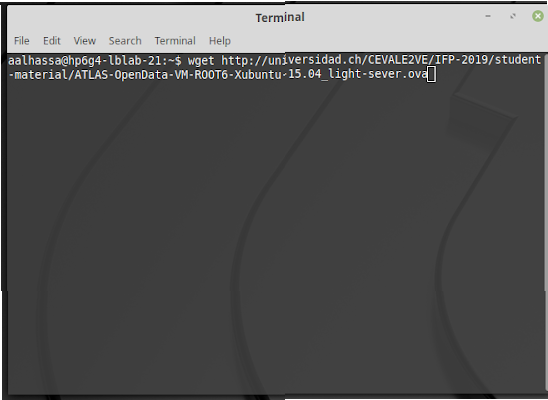

# كيفية إستخدام أدوات أطلس المفتوحة

* إطبع الأمر التالي على طرفية الحاسوب:

  * `wget` [`http://universidad.ch/CEVALE2VE/IFP-2019/student-material/ATLAS-OpenData-VM-ROOT6-Xubuntu-15.04_light-sever.ova`](http://universidad.ch/CEVALE2VE/IFP-2019/student-material/ATLAS-OpenData-VM-ROOT6-Xubuntu-15.04_light-sever.ova)\`\`

  

* انقر على أيقونة الـVirtualBox لتفعيله

* إنقر زر import لتحميل بقية الأدوات

*  من القائمة على اليسار، تأكد أن ATLAS OpenData باللون الأزرق من ثم اضغط زر Start

* على الآلة الإفتراضية:
  * أوقف العملية المفعلة بالضغط على ctrl + c ومن ثم “y” يتبعها “Enter”

* * أوقف العملية المفعلة بالضغط على ctrl + c ومن ثم “y” يتبعها “Enter” `./run-server-jupyter.sh`
* في جهازك الفعلي قم بـالتالي:

  * على متصفح الإنترنت إفتح العنوان التالي

     [http://localhost:8888/](http://localhost:8888/)

  

  * الآن بإمكانك فتح برامج بيانات أطلس المفتوحة بالضغط على Notebooks
  * لتشغيل أي برنامج إضغط على “restart and run all” من قائمة “kernel”

  

