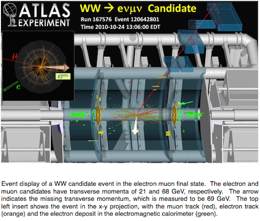
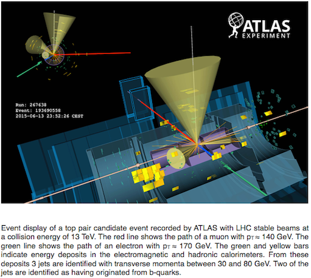

# التحليلات

محلل المدرج التكراري يركز على أربع عمليات فيزيائية: عملية [إشارة](https://alhassan-amel.gitbook.io/workspace/get-started-hep/untitled/glossary#signal) [بوزون](https://alhassan-amel.gitbook.io/workspace/get-started-hep/untitled/glossary#boson) هيقز−H→W+W ، و ثلاث عمليات [خلفية](https://alhassan-amel.gitbook.io/workspace/get-started-hep/untitled/glossary#background) هي WW، وt¯t ، و Z.  
دعونا نلقي نظرة على هذه العمليات.

## H→W+W− 

[بوزون هيقز](https://home.cern/topics/higgs-boson) هو مكون أساسي في [النموذج القياسي](https://home.cern/about/physics/standard-model) لفيزياء الجسيمات - النظرية التي تصف جميع الجسيمات الأولية المعروفة وتفاعلاتها.

يتفاعل [بوزون](https://alhassan-amel.gitbook.io/workspace/get-started-hep/untitled/glossary#boson) هيقز مع جميع جسيمات النموذج القياسي الأولية ذوات الكتلة. وبالتالي ، هناك طرق مختلفة لإنتاج [بوزون](https://alhassan-amel.gitbook.io/workspace/get-started-hep/untitled/glossary#boson) هيقز ، وطرق مختلفة لتحلل [بوزون](https://alhassan-amel.gitbook.io/workspace/get-started-hep/untitled/glossary#boson) هيقز إلى جسيمات أخرى.

واحدة من أكثر الطرق احتمالاً لتحلل [بوزون](https://alhassan-amel.gitbook.io/workspace/get-started-hep/untitled/glossary#boson) هيقز هي تحلله إلى زوج من بوزونات W. هذا يحدث حوالي 21 ٪ من الوقت لبوزون هيقز ذو الكتلة 125 قيقا إلكترون فولت. بعدها يمكن أن تتحلل بوزونات W إما إلى زوج من الكوارك ومضاد الكوارك \(q¯q\) ، أو إلى زوج من اللبتون و مضاد النيوترينو \(ℓ-¯ν\) ، أو إلى زوج من مضاد اللبتون و النيوترينو \( ℓ + ν \).

عملية الإشارة في محلل مدرج التكرارات هي عملية تحلل بوزون هيقز إلى إثنين من بوزونات W التي تتحلل لاحقًا إلى اللبتونات \(ℓ\) والنيوترونات \(ν\):

H→W+W−→ℓ+ℓ−ν¯ν

\(اللبتون في هذه الحالة إما إلكترون أو ميون\).

الميزة الرئيسية ، أو **العلامة المميزة** لعملية [الإشارة](https://alhassan-amel.gitbook.io/workspace/get-started-hep/untitled/glossary#signal) هذه ، عبارة عن لبتون معزول ذو pT عالي. يشير مصطلح pT إلى العزم العرضي\(المستعرض\) ، وهو مكون العزم العمودي على خط الحزمة \(بروتونات الإصطدام\). لسوء الحظ ، عمليات [الخلفية](https://alhassan-amel.gitbook.io/workspace/get-started-hep/untitled/glossary#background) الأساسية تحتوي أيضاً على لبتونات معزولة ذوات pT عالية ناتجة من تحللات [بوزون](https://alhassan-amel.gitbook.io/workspace/get-started-hep/untitled/glossary#boson) W أو Z.

في كثير من الأحيان يشير الفيزيائيون إلى الجسيمات و[الجسيمات المضادة](https://alhassan-amel.gitbook.io/workspace/get-started-hep/untitled/glossary#antiparticle) لها بشكل جماعي فقط باسم الجسيم. لذلك ، عندما نتحدث عن الكواركات فإننا نعني الكواركات و مضادات الكواركات. وبالمثل بالنسبة لللبتونات ومضادات اللبتونات والنيوتريونات ومضادات النيوترونات. وهو إختصار يعتمده الفيزيائيون للإيجاز.

## WW 

[بوزون](https://alhassan-amel.gitbook.io/workspace/get-started-hep/untitled/glossary#boson) W هو جسيم أساسي. هو مع [بوزون](https://alhassan-amel.gitbook.io/workspace/get-started-hep/untitled/glossary#boson) Z ، المسؤولان عن القوة الضعيفة ، واحدة من أربع [قوى أساسية](https://alhassan-amel.gitbook.io/workspace/get-started-hep/untitled/glossary#fundamental-forces) تحكم سلوك المادة في كوننا.

 يحدث إنتاج زوج [بوزونات](https://app.gitbook.com/@ooo-1/s/workspace/~/edit/drafts/-Lgw-P58kIXR0CXGGwfA/get-started-hep/untitled/glossary#boson) W عبر:

* **إبادة الكوارك بالكوارك المضاد:** q¯q→+W-W
* **عملية ثنائي الفوتونات:** γγ→+W-W
* **إنصهار القلوون:** gg→+W-W

يعتبر إنتاج زوج [بوزونات](https://alhassan-amel.gitbook.io/workspace/get-started-hep/untitled/glossary#boson) W عملية هامة للتحقق من [البنية العيارية](https://en.wikipedia.org/wiki/Gauge_theory) للنموذج القياسي والبحث عن [فيزياء جديدة](https://en.wikipedia.org/wiki/Physics_beyond_the_Standard_Model). وهي [خلفية](https://alhassan-amel.gitbook.io/workspace/get-started-hep/untitled/glossary#background) غير قابلة للإختزال للعديد من دراسات [بوزون](https://app.gitbook.com/@ooo-1/s/workspace/~/edit/drafts/-Lgw-P58kIXR0CXGGwfA/get-started-hep/untitled/glossary#boson) هيقز وعمليات البحث عن فيزياء جديدة. 

بوزونات W يمكن أن تتحلل بإحدى طريقتين: 

*  [لبتونياً](https://en.wikipedia.org/wiki/Lepton): الى إلكترون أو ميون مع نيوترينو.
* [هادرونياً](https://en.wikipedia.org/wiki/Hadron): إلى كوارك من النوع العلوي وكوارك من النوع السفلي.

تتميز عمليات تحلل [بوزون](https://alhassan-amel.gitbook.io/workspace/get-started-hep/untitled/glossary#boson) W اللبتونية بوجود لبتون معزول ذو طاقة عالية وفقدان كبير في العزم المستعرض. قد يحدث فقدان العزم العرضي بسبب هروب النيوتريونات من الكشف. 

تحلل [بوزون](https://alhassan-amel.gitbook.io/workspace/get-started-hep/untitled/glossary#boson) W هادرونياً يؤدي إلى وجود نفثتين بسبب وجود الكواركين. 

محلل مدرج التكرارات يراعي التحللات اللبتونية فقط. وبالتالي سترى عملية WW في [قنوات](https://app.gitbook.com/@ooo-1/s/workspace/~/edit/drafts/-Lgw-P58kIXR0CXGGwfA/get-started-hep/untitled/glossary#channel) الإلكترون-إلكترون \(ee\) ، و الميون-ميون \(mm\) ، و الإلكترون-ميون \(em\). 

تعتبر الحالات النهائية ذات اللبتونات والطاقة المفقودة معتادة في العديد من نماذج الفيزياء الجديدة ، ويعتبر [التناظر الفائق](https://home.cern/about/physics/supersymmetry) مثالًا كلاسيكيًا ، ولكن أيضًا بالنسبة للعديد من عمليات النماذج القياسية. 

يعد فهم العمليات النموذج القياسي التي تمتلك لبتونات متعددة و فقدان في الطاقة أمراً بالغ الأهمية في السعي لإكتشاف أو إستبعاد نماذج جديدة.

## t¯t 

تعتمد مولدات محاكاة البيانات ونماذج ديناميكا الكم الصبغية QCD و [دوال التوزيع البارتونية](https://alhassan-amel.gitbook.io/workspace/get-started-hep/untitled/glossary#parton-distribution-functions) جدًا على النماذج النظرية. نظراً للطاقة العالية جداً للأزواج القمية ، يمكن لبيانات الزوج القمى التحقق من مناطق مهمة في النماذج المذكورة أعلاه واختبار مدى جودة هذه النماذج.

يعتبر إنتاج زوج الكواركات القمية [خلفية](https://alhassan-amel.gitbook.io/workspace/get-started-hep/untitled/glossary#background) مهمة في تحليلات [بوزون](https://app.gitbook.com/@ooo-1/s/workspace/~/edit/drafts/-Lgw-P58kIXR0CXGGwfA/get-started-hep/untitled/glossary#boson) هيقز المختلفة و عمليات البحث عن ما وراء النموذج القياسي. لذلك من الضروري فهم هذه العملية بالتفصيل.

تتحلل الكواركات القمية مع احتمالية تقارب 100٪ إلى[ بوزون](https://app.gitbook.com/@ooo-1/s/workspace/~/edit/drafts/-Lgw-P58kIXR0CXGGwfA/get-started-hep/untitled/glossary#boson) W وكوارك قاعي. يتحول الـ W بدوره بصورة متساوية إلى زوج من اللبتونات أو زوج من الكواركات. ونظراً لوجود ثلاثة ألوان لكل كوارك ، يكون تحلل [بوزون](https://app.gitbook.com/@ooo-1/s/workspace/~/edit/drafts/-Lgw-P58kIXR0CXGGwfA/get-started-hep/untitled/glossary#boson) W إلى نفثتين أكثر احتمالًا بثلاث مرات من تحلله إلى إلكترون أو ميون.

ستظهر الكواركات القاعية الناتجة من تحلل الكواركين القميين في الحالة النهائية كنفثتين. تستخدم خوارزميات معينة لتحديد هذه النفثات. يُطلق على النفثات التي يُعتقد أنها ناشئة عن كواركات قاعية إسم نفثات مميزة-b.   
يمكن أن تنشأ نفثات إضافية في أحداث t -t من إشعاع القلوون.

نظراً لأن كل طاقة منتجات الانحلال تقريبًا مستمدة من طاقة السكون للزوج القمي / المضاد للقمي ، فإن إيجاد الطاقة الكلية لجميع منتجات التحلل وجمعها يجب أن ينتج عنه طاقة السكون \(وبالتالي كتلة\) الجسيمات التي تحللت. لكن يمكن للكاشف "رؤية" الجسيمات المشحونة فقط. إنه يفقد \(لا يرى\) النيوتريونات المنتجة في التحلل.

## Z 

بوزوني [W](http://home.cern/about/physics/w-boson-sunshine-and-stardust) و [Z](http://home.cern/about/physics/z-boson) يُعرفان بـ:البوزونات المتجهة الضعيفة أو الوسيطة.

في مصادم الهادرونات الكبير \(LHC\) ، تنتج بوزونات Z عن طريق:

* **Drell-Yan** : q¯q→Z/γ∗→μ+μ−\(65%\).  Z يباد كوارك واحد من بروتون مع مضاد كوارك من بروتون آخر ، وينشأ [فوتون إفتراضي](https://en.wikipedia.org/wiki/Virtual_particle) أو [بوزون](https://alhassan-amel.gitbook.io/workspace/get-started-hep/untitled/glossary#boson). الذي ثم يتحلل بدوره إلى زوج من اللبتونات متعاكسة الشحنة
* **تشتت كوارك مع قلوون**: qg→qZ/γ∗→qμ+μ− \(35%\).  يتفاعل كوارك مع [قلوون](https://en.wikipedia.org/wiki/Gluon) ويشع الكوارك فوتونًا افتراضيًا أو[ بوزون](https://app.gitbook.com/@ooo-1/s/workspace/~/edit/drafts/-Lh-BN0cuRKsTJs_VqSN/get-started-hep/untitled/glossary#boson) Z الذي يتحلل بعد ذلك إلى زوج من اللبتونات متعاكسة الشحنة.

و بدوره يتحلل [بوزون](https://alhassan-amel.gitbook.io/workspace/get-started-hep/untitled/glossary#boson) Z إلى:

* **زوج من الكوارك ومضاد الكوارك** \(70%\). هذه تظهر كنفثات. إذا تم تعريف النفثة على أنها ناشئة عن كوارك قاعي ، فسيتم تمييزها بـ: مميز-b
* **زوج من النيوترينو ومضاد النيوترينو** \(20%\). النيوترينو لا يتفاعل وبالتالي من الصعب إكتشافه. يمكن في بعض الأحيان تحديد طريقة تحلل النيوترينو هذه عن طريق فقدان العزم العرضي.
* **زوج من اللبتون ومضاد اللبتون** \(10%\). إحتمالية أزواج اللبتون الثلاثة متساوية ، الإلكترون-بوزيترون ، أو ميون-مضاد الميون ، أو تاو-مضاد التاو.

[بوزون](https://alhassan-amel.gitbook.io/workspace/get-started-hep/untitled/glossary#boson) Z  محايد ، وبالتالي يجب أن يكون مجموع شحنة نواتج تحلله صفراً.

في محلل مدرج التكرار يمكن دراسة الإنتاج الزوجي لللبتون و مضاده في [قناة](https://alhassan-amel.gitbook.io/workspace/get-started-hep/untitled/glossary#channel) الإلكترون-إلكترون \(ee\) و الميون-ميون \(mm\). التحلل إلى تاو غير مأخوذ في الحسبان في محلل مدرج التكرارات نسبةً لأن التحلل إلى إلكترونات و ميونات أسهل بكثير من التحلل إلى تاوات.

