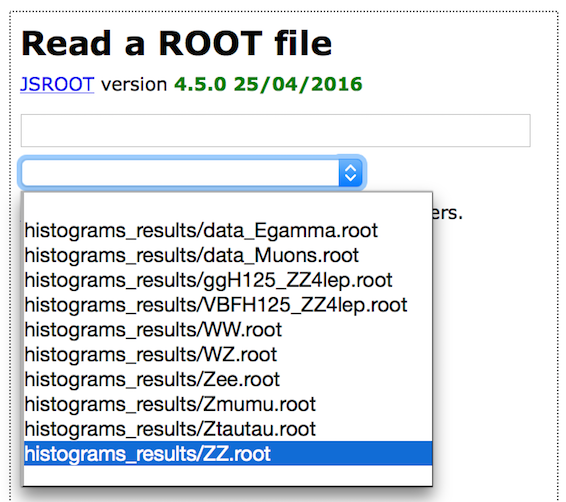
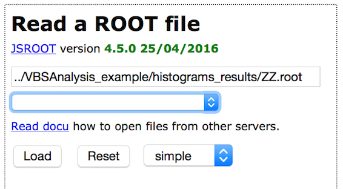
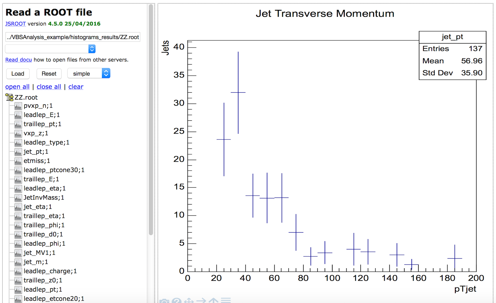

# متصفح التحليلات

**متصفحROOT هو أداة قائمة على الويب لعرض وتحليل البيانات وبيانات مونت كارلو المحاكاة.**

حدد مجموعة بيانات باستخدام القائمة المنسدلة \(مربع النص الثاني\).

يظهر الآن اسم مجموعة البيانات في مربع النص العلوي. اضغط على زر "تحميل".

بعدها يتم عرض المتغيرات المتاحة. حدد المتغير لعرض التوزيع.

يمكن تحميل واحد أو أكثر من مجموعات البيانات.يمكن عرض متغير واحد أو أكثر قي المرة الواحدة. تتوفر العديد من خيارات العرض \(خيار العرض الشبكي عليه دائرة باللون الأحمر أدناه\).

يعرض الخيار "بسيط" رسم بياني واحد فقط. يعرض خيار "شبكة \(grid\)" العديد من الرسوم البيانية إبتداء من خيارين \(خيار "الشبكة 1x2"\) حتى ستة عشر \(خيار "الشبكة 4x4"\).

إذا كنت ترغب في تغيير الخيار بعد تحديد ملفك ، فاضغط على "إعادة تعيين" وتمحى الرسوم البيانية الخاصة بك ، ولكن يبقى تحديد الملفات قائماً.

تتوفر معايير عرض إضافية \(محاطة بدائرة باللون الأخضر أدناه\) مثل ضبط المحور السيني و / أو المحور الصادي على مقياس لوغاريثمي.

