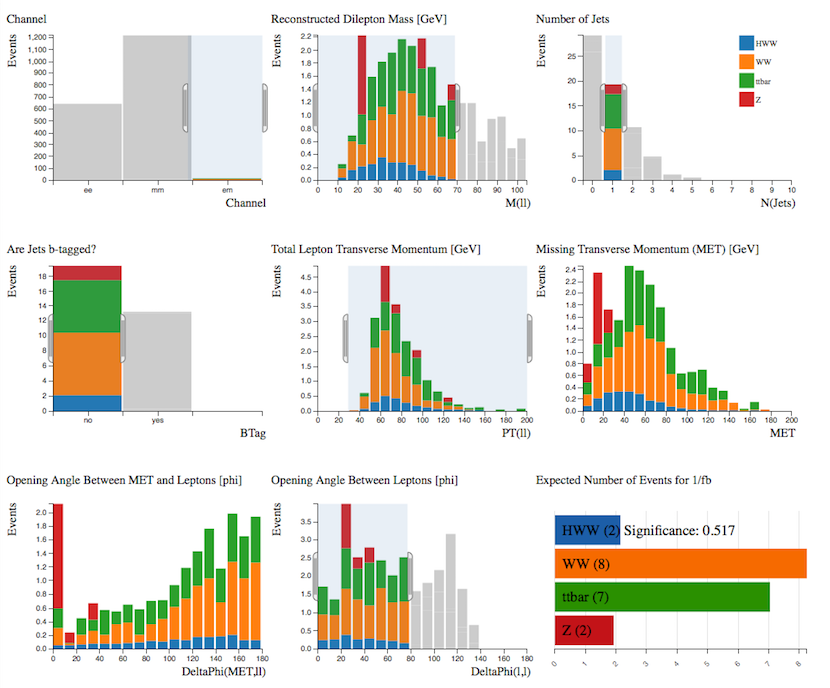

# أوجد هيقز

إتبع خطوات تحليل أطلس الحقيقية بإستخدام محلل المدرج التكراري

H→W+W−→ℓ+ℓ−ν¯ν

\(ℓ = لبتون = الكترون أو ميون\)

نحن نبحث عن [بوزون](https://alhassan-amel.gitbook.io/workspace/get-started-hep/untitled/glossary#boson) هيغز الذي يتحلل إلى إثنين من بوزونات W التي تتحلل بدورها إلى لبتونات ونيوتريونات.

المساهمات الأساسية في [الخلفية](https://alhassan-amel.gitbook.io/workspace/get-started-hep/untitled/glossary#background) لطريقة التحلل هذه قمية \(زوج كواركات قمية ، و كوارك قمي + W \) ، أحداث WW و Z +نقثات.

**استخدم المؤشر لتنفيذ القطوعات التالية ، واحدة تلو الأخرى.  
أثناء تطبيق القطوعات ، من المفترض أن ترى التوزيعات تتغير.**

حاول أن تفهم سبب تغير كل توزيع. فكر في الأسباب الفيزيائية التي تحفز على هذه القطوعات.

**لمسح تحديدك على رسم بياني معين ، انقر على الخلفية البيضاء داخل منطقة الرسم البياني.**

**لمسح جميع اختياراتك ، انقر فوق "محلل مدرج التكرارات \(Histogram Analyzer\)" ضمن البدء في القائمة العلوية الرئيسية.**

الآن دعونا نحاول فصل [الإشارة](https://alhassan-amel.gitbook.io/workspace/get-started-hep/untitled/glossary#signal) عن [الخلفية](https://alhassan-amel.gitbook.io/workspace/get-started-hep/untitled/glossary#background) باستخدام محلل مدرج التكرارات.

## بوزون هيقز + صفر نفثة 

نريد تحديد الأحداث التي تحتوي على اثنين من اللبتونات ، ولها عزم عرضي مفقود عالي وليس بها نفثات. 

تحديد:

   **- عدد النفثات = 0:** لقد قررنا أن هذا التحليل هو بالتحديد مع صفر نفثات.   
   **- كتلة ثنائي اللبتون المعاد بناؤها &lt; 75 قيقا إلكترون فولت:** أحداث بوزون Z تمثل [الخلفية](https://alhassan-amel.gitbook.io/workspace/get-started-hep/untitled/glossary#background) الأساسية لهذا التحليل. كتلة [بوزون](https://alhassan-amel.gitbook.io/workspace/get-started-hep/untitled/glossary#boson) Z تساوي 91 قيقا إلكترون فولت والتي يتم إعادة بنائها من كتلتي اللبتونين. إشتراط أن تكون كتلتي اللبتونين أقل من 75 قيقا إلكترون فولت يزيل أكثر من 90٪ من أحداث Z.  
   **- إجمالي العزم العرضي لللبتونات &gt; 30 قيقا إلكترون فولت:** بالنسبة لأحداث [بوزون](https://alhassan-amel.gitbook.io/workspace/get-started-hep/untitled/glossary#boson) Z ، يبلغ إجمالي العزم العرضي للليبتونات ذروته عند الصفر حيث أن العزم المستعرض لللبتونين يلغي بعضه بعضاً. بالنسبة لـ H → WW ، تميل [زاوية الفتح](https://alhassan-amel.gitbook.io/workspace/get-started-hep/untitled/glossary#opening-angle) بين اللبتونات إلى أن تكون صغيرة ، لذا يميل العزم الكلي المستعرض لليبتونات إلى أن يكون أكبر من الصفر.  
   **- العزم العرضي المفقود &gt; 40 قيقا إلكترون فولت:** يجب أن يؤدي هذا القطع إلى إزالة [الخلفية](https://alhassan-amel.gitbook.io/workspace/get-started-hep/untitled/glossary#background) Z نظرًا لأن العزم العرضي المفقود في أحداث بوزون Z يميل إلى أن يكون صغيراً. [بوزون](https://alhassan-amel.gitbook.io/workspace/get-started-hep/untitled/glossary#boson) Z يتحلل إلى لبتونات مشحونة ليس لديها أي النيوتريونات في الحالة النهائية في حين أن العمليات الأخرى لديها نيوتريونات في الحالة النهائية.  
   **-**[ **الزاوية المفتوحة**](https://alhassan-amel.gitbook.io/workspace/get-started-hep/untitled/glossary#opening-angle) **بين اللبتونات &gt; 80:** نعلم أن [زاوية الفتح](https://alhassan-amel.gitbook.io/workspace/get-started-hep/untitled/glossary#opening-angle) بين  اللبتونات لـعملية  H → WW تميل إلى أن تكون صغيرة في حين أن أحداث Z تكون [زاوية الفتح](https://alhassan-amel.gitbook.io/workspace/get-started-hep/untitled/glossary#opening-angle) كبيرة.

[ الخلفية](https://alhassan-amel.gitbook.io/workspace/get-started-hep/untitled/glossary#background) المهيمنة بعد كل هذه القطوعات في [قناة](https://alhassan-amel.gitbook.io/workspace/get-started-hep/untitled/glossary#channel)   
[بوزون](https://alhassan-amel.gitbook.io/workspace/get-started-hep/untitled/glossary#boson) هيقز + 0 [نفثة](https://alhassan-amel.gitbook.io/workspace/get-started-hep/untitled/glossary#jet) تأتي من WW و Z + نفثات. 

تم تحديد 3 أحداث هيغز ، مما جعل مقدار الأهمية 0.277

## بوزون هيقز + نفثة واحدة 

تحديد: 

-عدد النفثات = 1   
- لا توجد نفثات مميزة-b  
 - [قناة](https://alhassan-amel.gitbook.io/workspace/get-started-hep/untitled/glossary#channel) الإلكترون-ميون فقط   
- ****كتلة ثنائي اللبتون المعاد بناؤها &lt; 70 قيقا إلكترون فولت  
- إجمالي العزم العرضي لللبتونات &gt; 30 قيقا إلكترون فولت  
****- [الزاوية المفتوحة](https://alhassan-amel.gitbook.io/workspace/get-started-hep/untitled/glossary#opening-angle) بين اللبتونات &gt; 80

[ الخلفية](https://alhassan-amel.gitbook.io/workspace/get-started-hep/untitled/glossary#background) المهيمنة بعد كل هذه القطوعات في [قناة](https://alhassan-amel.gitbook.io/workspace/get-started-hep/untitled/glossary#channel)   
[بوزون](https://alhassan-amel.gitbook.io/workspace/get-started-hep/untitled/glossary#boson) هيقز + 1 [نفثة](https://alhassan-amel.gitbook.io/workspace/get-started-hep/untitled/glossary#jet) تأتي من WW و الإنتاج الزوجي لكواركات القمة. 

تم تحديد 2 من أحداث هيغز ، مما جعل مقدار الأهمية 0.517

## جرب بنفسك! 

ربما تود أن تجرب -H → W + W + صفر 0 [نفثة](https://alhassan-amel.gitbook.io/workspace/get-started-hep/untitled/glossary#jet)، لكن قم بفصلها في قنوات لبتونية وقم بضبط القطوعات لزيادة عدد أحداث H → W + W للحصول على أقصى قدر من الأهمية. 

أو جرب شيئًا مختلفًا تمامًا ...

