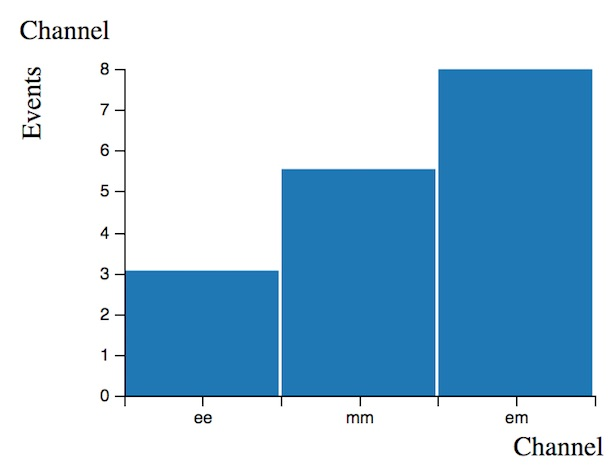
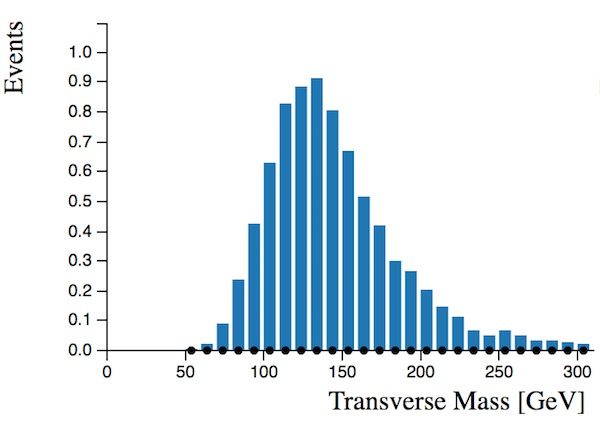
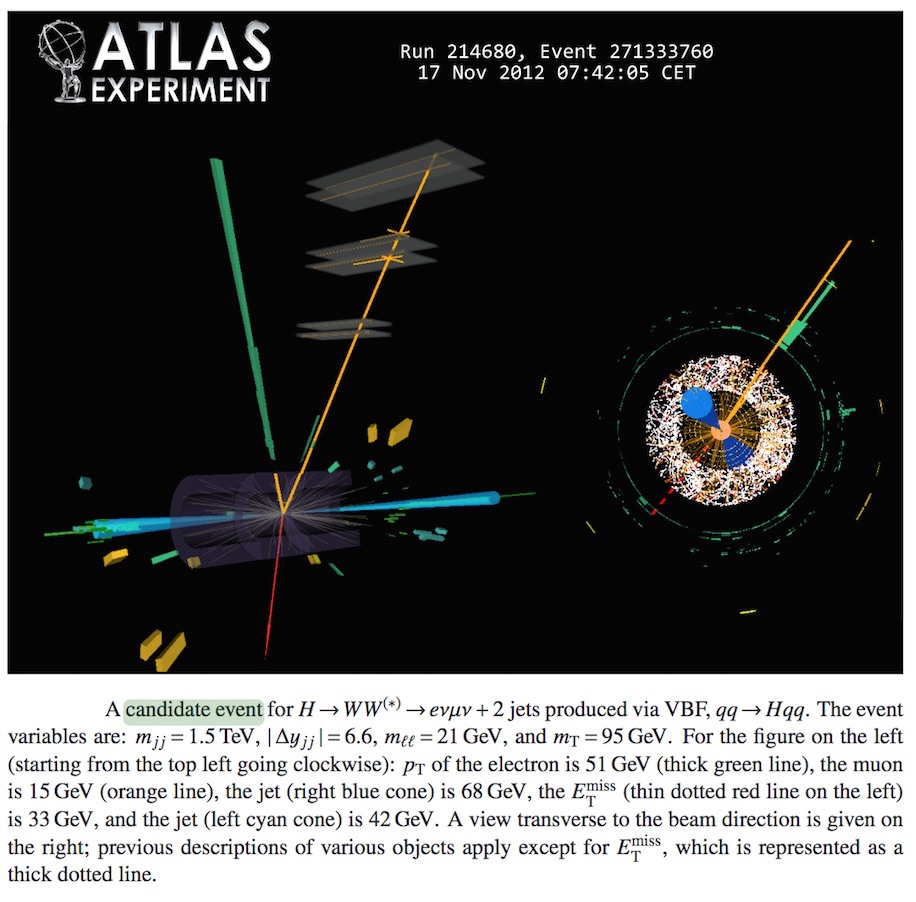

# محلل مدرج البيانات 2

يشتمل محلل المدرج التكراري الثاني على بيانات. تظهر هذه البيانات في شكل نقاط سوداء عليها أعمدة الخطأ.

هنا سننظر فقط إلى [قناة](https://alhassan-amel.gitbook.io/workspace/get-started-hep/untitled/glossary#channel) الإلكترون-ميون. من قبل كان لدينا 17 مرشح هيقز \(أنظر إلى مدرج تكرارات الأحداث مقابل [القنوات](https://alhassan-amel.gitbook.io/workspace/get-started-hep/untitled/glossary#channel) أدناه\) والآن نحن ننظر إلى 8 مرشحين فقط \( انظر إلى مدرج تكرارات عدد الأحداث المتوقعة أعلاه\). ولكن [خلفية](https://alhassan-amel.gitbook.io/workspace/get-started-hep/untitled/glossary#background) Z تم تقليلها بشكل كبير مما يجعل هذا خياراً جيداً.

الأرقام الموضحة على عدد الأحداث المتوقعة - كما من قبل- تم حسابها بواسطة محاكاة مونت كارلو.

أضفنا أيضا رسم بياني جديد وهو الكتلة العرضية. الكتلة المستعرضة تشبه الكتلة الثابتة غير أنها تتجاهل العزم الطولي لمنتجات التحلل.

من المفيد تعريف الكتلة المستعرضة mT لإستخدامها في فيزياء الجسيمات حيث أنها كمية غير متغيرة تحت دفع لورنتز على الإحداثي ع. بالوحدات الطبيعية يتم تعريفاها على أنها:

m2T=m2+p2x+p2y=E2−p2z

حيث يكون إتجاه ع على طول أنبوب الحزمة ولذا فإن px و py هما العزمين العموديين على أنبوب الحزمة و m هي الكتلة الثابتة. 

في هذه الدراسة ، يتم تعريف الكتلة المستعرضة على أنها:

mT=\(\(EllT+EmissT\)2−\|pllT+EmissT\|2\)1/2

حيث EllT=\(\|pllT\|2+m2ll\)1/2

إذا قمت بتحديد أحداث هيقز فقط بالنقر فوق H → WW في المدرج التكراري \(العدد المتوقع للأحداث\) ، سترى الكتلة العرضية للهيقز. وكما هو متوقع ، فإن قمة المدرج هي عند كتلة الهيغز 125 قيقا إلكترون فولت.

حدد -بالمؤشر الخاص بك-  الأحداث التي تحتوي نفثتين N \(Jets\) = 2. ستلاحظ أن كل من نقاط البيانات وتوزيعات مونت كارلو المحاكاة تتغير. البيانات ومحاكاة مونت كارلو ليست هي نفسها بالضبط ، ولكن اﻹتفاق العام جيد جداً. هذا يدل على أن هذه العمليات مفهومة بصورة جيدة وأنه قد تم نمذجتها بشكل جيد.

كما في السابق ، قم بإجراء بعض التحديدات لفصل [إشارة](https://alhassan-amel.gitbook.io/workspace/get-started-hep/untitled/glossary#signal) [بوزون](https://alhassan-amel.gitbook.io/workspace/get-started-hep/untitled/glossary#boson) هيقز عن [الخلفية](https://alhassan-amel.gitbook.io/workspace/get-started-hep/untitled/glossary#background).

هل بإستطاعتك زيادة الأهمية لأكثر من 0.2؟

يوجد أدناه عرض [حدث](https://alhassan-amel.gitbook.io/workspace/get-started-hep/untitled/glossary#event) ، حيث تم تحديد مرشح هيقز يتحلل إلى إلكترون وميون.

