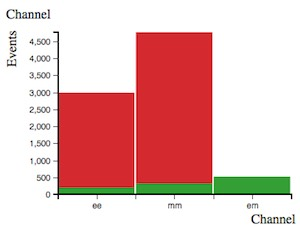
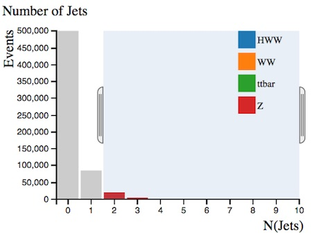
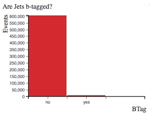
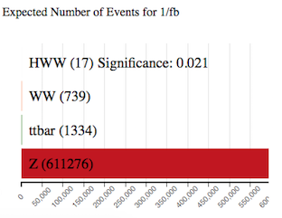
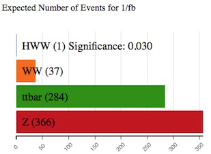
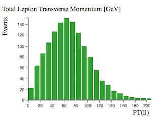
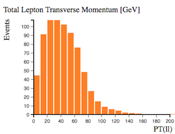
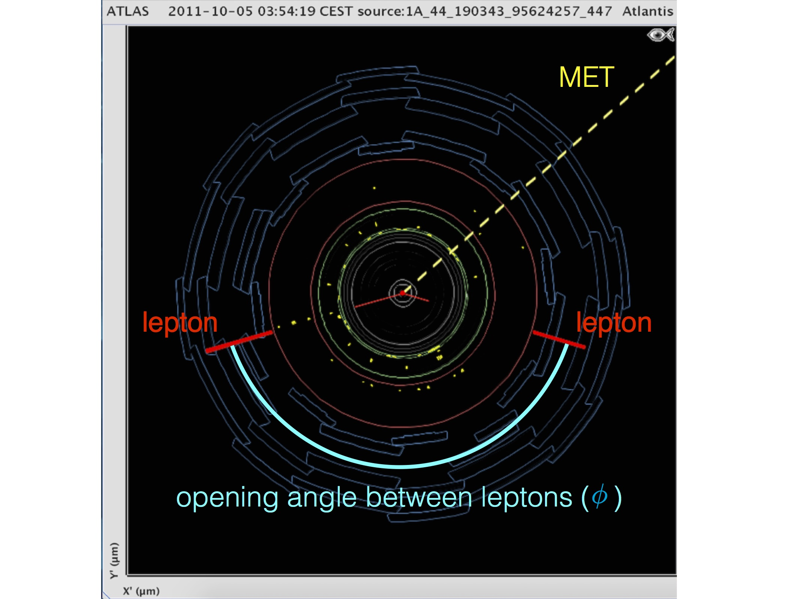
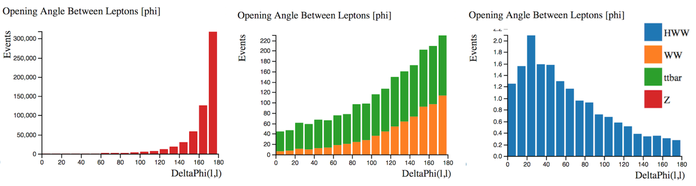

# محلل مدرج البيانات

يستخدم الفيزيائيون **القطوعات** لتحديد الأحداث المهمة. القطوعات بطريقة تفضيلية تقوم بإزالة العمليات غير المرغوب فيها \([الخلفية](https://alhassan-amel.gitbook.io/workspace/get-started-hep/untitled/glossary#background)\) ولكنها تترك أكبر قدر ممكن من العملية المطلوبة \([الإشارة](https://alhassan-amel.gitbook.io/workspace/get-started-hep/untitled/glossary#signal)\). من المفيد أن يكون لديك فهم جيد للعلمليات الفيزيائية المنطوية عند تطبيق القطوعات.

لقد أنشأنا اثنين من أجهزة تحليل المدرج الإحصائي للمساعدة في تصوير البيانات: مُحلل المدرج التكراري الأول يعرض فقط أحداثًا تمت محاكاتها.  
محلل المدرج الإحصائي الثاني يعرض كلاً من البيانات الحقيقية والأحداث المحاكاة. كلا محللي المدرج التكراري يعرضان أربع عمليات فيزيائية.

الأربع عمليات الفيزيائية هي  −H→W+W ، و WW، وt¯t ، و Z.  
يتم مناقشة هذه العمليات في الفصل التالي. يتم تمثيل كل عملية بلون مختلف في مُحلل المدرج التكراري.

## إصنع قطوعات بواسطة المؤشر 

استخدم المؤشر لتحديد نطاق معين في أحد المدرجات التكرارية.  
سيتم تلوين النطاقات المحددة ، في حين ستصبح النطاقات غير المحددة رمادية اللون. عندما تقوم بإجراء قطوعات على متغير ما ، ستتغير المساهمات النسبية للعمليات الأربع.

**لمسح التحديد الذي قمت بعمله على رسم بياني معين ، انقر على** [**الخلفية**](https://alhassan-amel.gitbook.io/workspace/get-started-hep/untitled/glossary#background) **البيضاء داخل منطقة الرسم البياني.**

**لمسح جميع اختياراتك ، انقر على "محلل المدرج التكراري" تحت إبدأ في القائمة العلوية الرئيسية.**

## شرح مدرج البيانات 

محلل المدرج التكراري الخاص بـ**البيانات المحاكِيَة لتحلل هيقز الى WW** يعرض تسعة رسوم بيانية. فيما يلي وصف كل منها:

## عدد الأحداث المتوقعة لـ 1/fb 

يوضح هذا  المدرج التكراري عدد الأحداث المتوقع أن يتم اكتشافها وإعادة بنائها وتسجيلها بواسطة أطلس مقابل واحد من الفيمتو بارن \(1\fb\) من البيانات.  
معكوس الفيمتوبارن الواحد يعادل حوالي 100 تريليون اصطدام بروتون-بروتون.

 يختلف عدد الأحداث المتوقع أن يتم إعادة بنائها وتسجيلها بواسطة أطلس عن عدد الأحداث المنتجة.  
بعض الأحداث لن يتم إعادة بناءها نسبة للطريقة التي تم بها بناء الكاشف ، ودقة أجهزة الكشف الفرعية ، وكفاءة إعادة البناء وغيرها من أوجه القصور. 

بدون أي قطوعات ، لدينا سبعة عشر حدثًا من أحداث تحلل الهيقز إلى W سالب و W موجب -H → W+ W ، مع [خلفية](https://alhassan-amel.gitbook.io/workspace/get-started-hep/untitled/glossary#background) إجمالية تبلغ 613349 حدث. غالبية [الخلفية](https://alhassan-amel.gitbook.io/workspace/get-started-hep/untitled/glossary#background) هي إنتاج [بوزون](https://alhassan-amel.gitbook.io/workspace/get-started-hep/untitled/glossary#boson) Z. 

**مدى ظهور** أحداث −H → W+ W يعطي قيمة لمدى "بروز" عينة هيغز عن [الخلفية](https://alhassan-amel.gitbook.io/workspace/get-started-hep/untitled/glossary#background). يتم حساب هذه القيمة بواسطة \(عدد أحداث −H → W + W / \(عدد أحداث [الخلفية](https://alhassan-amel.gitbook.io/workspace/get-started-hep/untitled/glossary#background)\)√\).   
**كلما كانت قيمة البروز أكبر ، كانت المهمة التي قمت بها هي استخراج** [**إشارة**](https://alhassan-amel.gitbook.io/workspace/get-started-hep/untitled/glossary#signal) **هيجز أفضل**.

## القناة 

تظهر هنا قنوات الانحلال اللبتوني: ثنائي الإلكترونات \(ee\) وثنائي الميونات \(mm\) و الإلكترون-ميون \(em\). تحلل التاو و تحللات الهادرونات ليست محل النظر في محلل مدرج التكرارات.

محلل المدرج التكراري للبيانات المحاكاة يظهر ثلاث قنوات لبتونية. محلل المدرج التكراري للبيانات المحاكاة والبيانات الحقيقية يظهر [قناة](https://alhassan-amel.gitbook.io/workspace/get-started-hep/untitled/glossary#channel) الإلكترون-ميون فقط، وبالتالي هذا المدرج غير معروض هنا.

## كتلة ثنائي اللبتون المعاد بنائها \[قيقا الكترون فولت\] 

يعرض مدرج التكرارات هذا الكتلة التي أعيد بناؤها من اللبتونين في الحالة النهائية.

بدون أي استقطاعات تكون قمة المدرج عند 60 قيقا إلكترون فولت. والسبب هو المساهمة الكبيرة لـ[بوزون Z](http://pdg.lbl.gov/2012/listings/rpp2012-list-z-boson.pdf).

  

بإمكننا إزالة عدد كبير من أحداث [بوزون](https://alhassan-amel.gitbook.io/workspace/get-started-hep/untitled/glossary#boson) Z عن طريق اختيار **كتلة ثنائي الللبتونات المعاد بنائها** لتكون أقل من 75 قيقا إلكترون فولت ، في حين لا نكاد نلمس [إشارة](https://alhassan-amel.gitbook.io/workspace/get-started-hep/untitled/glossary#signal) هيقز الموجودة لدينا.  
بهذا القطع يزداد ظهور عينة −H→W+W من 0.021  إلى 0.110.  
وبهذا فإن هذه تعتبر كمية مفيدة للإستخدام لتقليل [خلفية](https://alhassan-amel.gitbook.io/workspace/get-started-hep/untitled/glossary#background) [بوزون](https://alhassan-amel.gitbook.io/workspace/get-started-hep/untitled/glossary#boson) Z الضخمة.

## عدد النفثات 

عدد النفثات الموجودة في [الحدث](https://alhassan-amel.gitbook.io/workspace/get-started-hep/untitled/glossary#event).

عند اختيار نفثنين أو أكثر ، نرى أن مساهمة بوزون Z تنخفض \(من 611276 إلى 25422\) وتصبح مساهمة t¯ t هي الأكثر أهمية.

عند اختيار نفثنين أو أكثر ، ترتفع نسبة أحداث t¯t إلى أحداث بوزون Z من 1334/611276 = 0.002 إلى 1038/25422 = 0.04. وتصبح مساهمة t¯t الخضراء الآن ملحوظة في الرسم البياني.

إنتاج زوج الكواركات القمِّية t¯t يقود إلى الحالة النهائية WW +\(زائد\) نفثات.

## هل النفثات مميزة-b؟ 

النفثات الناشئة عن الكوارك القاعي b يتم تعريفها و تعليمها أو **تمييزها** بإستخدام خوارزميات تمييز b.

  
  
  

يتوقع وجود النفثات المميزة-b في تحللات الكوارك القمي، ولكنها غير متوقعة في تحللات اللبتونات W و Z.

إختيار ' هل النفثات مميزة-b؟' بنعم يزيد نسبة أحداث t¯t إلى أحداث بوزون Z من 1334/611276 = 0.002 إلى 1041/7227 = 0.14. وتصبح مساهمة t¯t الخضراء الآن ملحوظة في مدرجات التكرار.

## العزم العرضي المفقود \(MET\) \[قيقا الكترون فولت\] 

في مصادم الهادرونات الكبير ، الطاقة الأولية للبارتونات المتصادمة \(الكواركات أو القلوونات\) على طول محور الحزمة تكون غير معروفة. يرجع السبب في ذلك إلى أن طاقة  كل بروتون تكون متشاركة و متغيرة بصورة مستمرة بين مكوناته.

ولكن العزم الأولي للجزيئات التي تنتقل عرضياً بالنسبة إلى محور الشعاع يساوي صفر.  
وبالتالي فإن وجود أي عزم صافٍ في الإتجاه المستعرض يشير إلى عزم عرضي مفقود.

العزم العرضي المفقود يستخدم لإستنتاج وجود جسيمات غير قابلة للإكتشاف مثل النيوترينو.  
من المتوقع أيضاً أن يكون هذا أثر مميز للعديد من أحداث الفيزياء المتوقعة فيما بعد النموذج القياسي ، مثلاً أخف الجسيمات [فائقة التناظر](http://home.cern/scientists/updates/2013/10/supersymmetry-searches-atlas).

لأسباب تاريخية ، الإختصار الرسمي للعزم العرضي المفقود هو MET.

  

[بوزون](https://alhassan-amel.gitbook.io/workspace/get-started-hep/untitled/glossary#boson) Z يتحلل إلى لبتونات مشحونة ليس لديها أي نيوتريونات في الحالة النهائية في حين أن العمليات الأخرى تكون لديها  نيوتريونات في الحالة النهائية.

هذا هو السبب في أن جعل العزم العرضي المفقود مطلوب يزيل أحداث [بوزون](https://alhassan-amel.gitbook.io/workspace/get-started-hep/untitled/glossary#boson) Z.

إختر العزم العرضي المفقود وشاهد كيف تتغير نسبة أحداث WW و \(ttbar  \(t¯t إلى Z.

## عزم اللبتون العرضي الكلي \[قيقا الكترون فولت\] 

هذا هو [المجموع الإتجاهي](https://ar.wikipedia.org/wiki/%D9%85%D8%AA%D8%AC%D9%87%D8%A9#%D8%AC%D9%85%D8%B9_%D9%85%D8%AA%D8%AC%D9%87%D8%A7%D8%AA) للعزم العرضي لللبتونات المشحونة المشاهدة.

بالنسبة لأحداث [بوزون](https://alhassan-amel.gitbook.io/workspace/get-started-hep/untitled/glossary#boson) Z ، فإن العزم العرضي الكلي لللبتونات تكون قمته عند الصفر. وذلك لأن العزمين العرضييين لللبتونين يلغيان بعضهما البعض.

  

بالنسبة للعمليات الأخرى ، فإن هذا الإلغاء لا يكون بهذا الوضوح. حيث تتراوح قمة توزيعاتها بين 30 و 80 قيقا إلكترون فولت.

## الزاوية المفتوحة بين اللبتونات \[فاي\] 

هي [الزاوية المفتوحة](https://alhassan-amel.gitbook.io/workspace/get-started-hep/untitled/glossary#opening-angle) بين اللبتونين ، المقاسة على محور فاي \(𝜙\).  
الزاوية السمتية ϕ تقاس من المحور السيني و حول الحزمة. 

في عرض [الحدث](https://alhassan-amel.gitbook.io/workspace/get-started-hep/untitled/glossary#event) أعلاه ، يعرض مساري اللبتونين باللون الأحمر ويتم تمييز [زاوية الفتح](https://alhassan-amel.gitbook.io/workspace/get-started-hep/untitled/glossary#opening-angle) بينهما باللون الأزرق.

إذا كان إنبعاث اللبتونين ظهراً إلى ظهر ، سيظهر ذلك على مدرج التكرار على أنه 180 درجة.  
أحداث H → W + W تظهر ذروة عند قيمة منخفضة على عكس جميع العمليات الأخرى.

## الزاوية المفتوحة بين الـ MET و اللبتونات  \[فاي\] 

هي [الزاوية المفتوحة](https://alhassan-amel.gitbook.io/workspace/get-started-hep/untitled/glossary#opening-angle) - والمقاسة على محور فاي \(𝜙\) - بين العزم العرضي المفقود \(MET\) و اللبتونين.

في عرض [الحدث](https://alhassan-amel.gitbook.io/workspace/get-started-hep/untitled/glossary#event) أعلاه ، يتم تمثيل الطاقة المستعرضة المفقودة بواسطة الخط الأصفر المتقطع. يمثل الخط الأحمر المنقط خط الوسط بين مساري اللبتونين \(إتجاه [المجموع المتجهي](https://alhassan-amel.gitbook.io/workspace/get-started-hep/untitled/glossary#vectorial-sum) لعزميهما المستعرضين\). [الزاوية المفتوحة](https://alhassan-amel.gitbook.io/workspace/get-started-hep/untitled/glossary#opening-angle) بين MET و اللبتونين تظهر باللون الأصفر.

الأحداث التي تحتوي t¯t و Z تظهر توزيعًا متساوٍ نسبيًا لهذا المتغير في حين بالنسبة لـ −H → W + W و WW تكون القمة عند قيم كبيرة.

هذا تمييز مفيد لإزالة أحداث [الخلفية](https://alhassan-amel.gitbook.io/workspace/get-started-hep/untitled/glossary#background).

