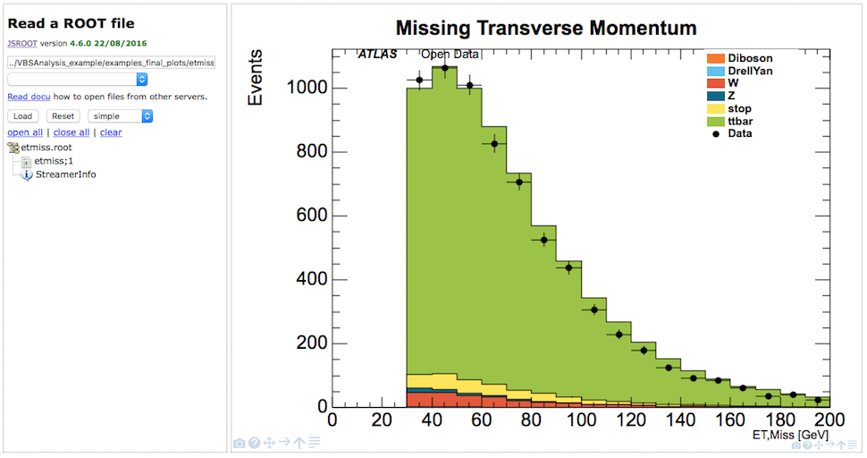
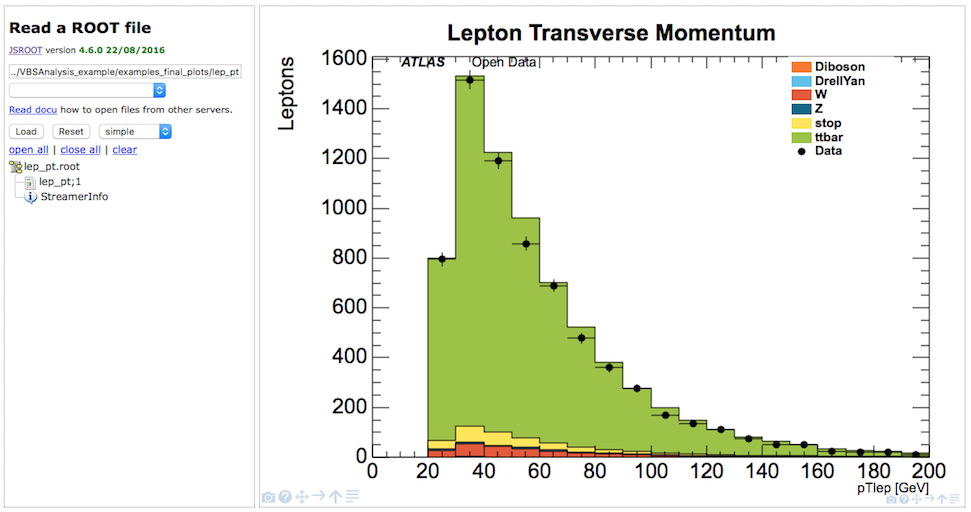

# ROOTالرسومات النهائية لمتصفح

## رسومات فيزياء الطاقة العالية المعقدة \(HEP\) تعمل. 

يسمح لك متصفحROOT أيضًا بإلقاء نظرة على بعض المدرجات التكرارية الجاهزة لـHEP .

تم تنفيذ تحليل لحدث [بوزون](https://alhassan-amel.gitbook.io/workspace/get-started-hep/untitled/glossary#boson) W واحد حيث يتحلل [بوزون](https://alhassan-amel.gitbook.io/workspace/get-started-hep/untitled/glossary#boson) W إلى لبتونات.

تحتوي القائمة المنسدلة \(مربع النص الثاني\) على عدد من أمثلة للرسومات النهائية لتحليل W هذا.

كما في السابق ، حدد الملف الذي تهتم به

في هذه الحالة 'examples\_final\_ploys/WtMass.root

إضغط زر التحميل 'Load' 

من ثم يعرض الرسم البياني. في هذه الحالة ، انقر فوق 'WtMass;1'

يتم عرض البيانات في شكل نقاط سوداء. العينات المحاكاة المختلفة يتم عرضها عن طريق الملء بالألوان ، ومن ثم تكديسها فوق بعضها البعض. الشكل الإجمالي للعينات المحاكاة يشبه توزيع البيانات \(الحقيقية\) كثيراً. هناك اتفاق جيد إلى حد ما بين البيانات والبيانات المحاكاة. 

يحتمل أن يكون تحليل W عرضة لمساهمات QCD حيث لا يوجد سوى لبتون واحد حالياً ، الذي قد يأتي من مصادر غير فورية ويحاكي الحالة النهائية المطلوبة. لذلك ، التناقضات المحتملة يجب دائمًا فهمها على أنها إشارة إلى عدم مراعاة مساهمات QCD. لم يتم تضمين عينات QCD حيث أن لها إحصائيات منخفضة للغاية بعد التحديد بينما ملفها ذو حجم كبير.

تتأثر توزيعات الكتلة المستعرضة وكذلك العزم المستعرض المفقود بإغفال مساهمات QCD ، والتي غالباً ما تغلب على العزم العرضي المفقود المنخفض ومناطق الكتلة العرضية المنخفضة.

المجال المغناطيسي يحني الجسيمات المشحونة ، مما يسمح بقياس العزم بإستخدام إنحناء المسارات. يُظهر المدرج التكراري عزم اللبتونات العرضي على إتجاه الحزمة.

إذا قمت بتمرير المؤشر فوق نقطة بيانات ، فستظهر مربعات تعرض الإحصائيات. المربع السفلي يعرض المعلومات الخاصة بالبيانات ، لذلك في هذه الحالة ، يوجد 858 لبتون مع pT بين 50 و 60 قيقا إلكترون فولت. مربع الإحصائيات العلوي يعرض إجمالي مساهمة البيانات المحاكاة ، 961.4 إدخال.

طاقة اللبتونات يتم قياسها بواسطة المسعرات الكهرومغناطيسية. الوصف العام للحركية اللبتونية من خلال البيانات المحاكاة جيد.

موصوفة بصورة أقل دقة هي متغيرات التتبع و[العزل](https://alhassan-amel.gitbook.io/workspace/get-started-hep/untitled/glossary#isolation). هذا يشير إلى أن مساهمات QCD مفقودة. في هذه المنطقة ، تساهم عمليات QCD إما عن طريق التحديد الخاطئ للـ[نفثة](https://alhassan-amel.gitbook.io/workspace/get-started-hep/untitled/glossary#jet) على أنها لبتون أو عن طريق تحلل هادرون إلى لبتونات داخل [النفثة](https://alhassan-amel.gitbook.io/workspace/get-started-hep/untitled/glossary#jet). هذه اللبتونات التى تدعى غير الفورية لا يتم عزلها بشكل جيد مما ينتج عنه قيم أعلى لمتغيرات [العزل](https://alhassan-amel.gitbook.io/workspace/get-started-hep/untitled/glossary#isolation).

يعرض[ نفثة](https://alhassan-amel.gitbook.io/workspace/get-started-hep/untitled/glossary#jet) MV1 وزن المميزة-b الذي تم الحصول عليها من خوارزمية تمييز[ النفثة](https://alhassan-amel.gitbook.io/workspace/get-started-hep/untitled/glossary#jet) استنادًا إلى تقنيات تعدد المتغيرات. تشير القيم العالية إلى النفثات الناشئة من الكواركات القاعية \(نفثات المميزة-b\).

يتم وصف متغيرات [النفثة](https://alhassan-amel.gitbook.io/workspace/get-started-hep/untitled/glossary#jet) بشكل جيد من خلال البيانات المحاكاة. الإختلاف الطفيف قد يعزى إلى فقدان مساهمات QCD.

## أمثلة لمتفيرات الرسومات النهائية 

* WtMass : Wالكتلة المستعرضة لمرشح [بوزون](https://alhassan-amel.gitbook.io/workspace/get-started-hep/untitled/glossary#boson) 
* etmiss : العزم العرضي المفقود
* jet\_MV1 : وزن محسوب عن طريف خوارزمية تقنيات تعدد المتغيرات
* jet\_eta : التوالي الزائف [للنفثة](https://alhassan-amel.gitbook.io/workspace/get-started-hep/untitled/glossary#jet)
* jet\_jvf : كسر الرأس [للنفثة](https://alhassan-amel.gitbook.io/workspace/get-started-hep/untitled/glossary#jet) \(JVF\)
* jet\_m :  كتلة[ النفثة](https://alhassan-amel.gitbook.io/workspace/get-started-hep/untitled/glossary#jet)
* jet\_pt : عزم [النفثة](https://alhassan-amel.gitbook.io/workspace/get-started-hep/untitled/glossary#jet)
* lep\_E : طاقة اللبتون
* lep\_charge : شحنة اللبتون
* lep\_d0 : عامل التتبع المعلَّم للتأثير العرضي
* lep\_eta : التوالي الزائف لللبتون
* lep\_etconerel20 :  
  * المجموع القياسي لمسارات Et في مخروط **نصف قطره** R = 0.2 حول اللبتون ، ولا يشمل ذلك Et اللبتون نفسه
* lep\_n : عدد االلبتونات
* lep\_phi : قيمة فاي للبتون
* lep\_pt : العزم المستعرض للبتون
* lep\_ptconerel30 : 
  * المجموع القياسي لمسارات Pt في مخروط **نصف قطره** R = 0.3 حول اللبتون ، ولا يشمل ذلك Pt اللبتون نفسه
* lep\_type : رقم لتحديد نوع اللبتون \(إلكترون ، ميون ، تاو\)
* lep\_z0 : الاحداثي ع للمسار المرتبط باللبتون بالنسبة للرأس الأولي
* n\_jets :عدد النفثات
* pvxp\_n : عدد الرؤوس الأولية
* vxp\_z : موضع الرأس الأولي على الإحداثي ع

