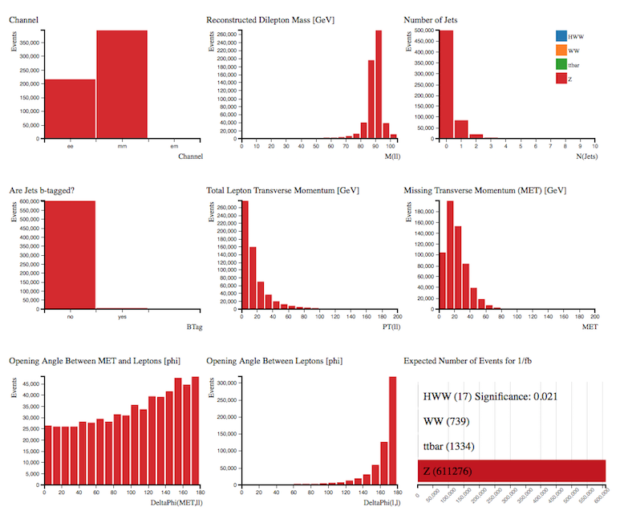

# إشارات منفصلة

دعونا نلقي نظرة على البيانات المحاكاة.   
بإستخدام محلل المدرج التكراري ، يمكننا النظر في كل عينة على حدة وفهم المزيد عن خصائصها.   
هذا الأمر سيساعدنا لاحقاً على فصل [الإشارة](https://alhassan-amel.gitbook.io/workspace/get-started-hep/untitled/glossary#signal) التى تعنينا عن [الخلفية](https://alhassan-amel.gitbook.io/workspace/get-started-hep/untitled/glossary#background). 

**حدد العينة عن طريق النقر فوق الشريط الموجود في المدرج التكراري لعدد الأحداث المتوقعة**.  
 بقية الرسومات البيانية تعرض الآن خصائص العينة التي اخترتها.

## H→W+W− 

H→W+W−→ℓ+ℓ−ν¯ν

\( ℓ = إلكترون ، أو ميون\)

[الإشارة](https://alhassan-amel.gitbook.io/workspace/get-started-hep/untitled/glossary#signal) لدينا هي [بوزون](https://alhassan-amel.gitbook.io/workspace/get-started-hep/untitled/glossary#boson) هيقز الذي يتحلل إلى إثنين من بوزونات W التي تتحلل بدورها إلى اللبتونات والنيوتريونات.

دعونا نلقي نظرة على الرسومات البيانية كل على حدى:

* يأخذ التحليل في الإعتبار تحللات [بوزون](https://alhassan-amel.gitbook.io/workspace/get-started-hep/untitled/glossary#boson) هيقز إلى الإلكترون والميون ، وبالتالي فإن الأحداث تحدث في جميع القنوات الثلاث.
* الكتلة المعاد بناؤها من ذرتي اللبتونين تكون قمتها بين 25-45 قيقا إلكترون فولت.
* تحتوي غالبية أحداث هيقز ما بين 0 أو 1 [نفثة](https://alhassan-amel.gitbook.io/workspace/get-started-hep/untitled/glossary#jet).
* معظم الأحداث لا تحتوي على نفثات مميزة-b.
* العزم المستعرض الكلي يبلغ ذروته عند حوالي 60 قيقا إلكترون فولت.
* العزم المستعرض  المفقود تسببه النيوترونات في الحالة النهائية
* [زاوية الفتح](https://alhassan-amel.gitbook.io/workspace/get-started-hep/untitled/glossary#opening-angle) بين العزم العرضي المفقود واللبتونات تميل إلى أن تكون كبيرة.
* [زوايا الفتح](https://alhassan-amel.gitbook.io/workspace/get-started-hep/untitled/glossary#opening-angle) بين اللبتونات الناتجة من تحلل هيجز تميل  إلى أن تكون صغيرة.

## WW 

إثنان من لبتونات W كلاهما يتحللان لبتونياً.

لنلقي نظرة على الرسومات البيانية كل على حدى:

* يأخذ التحليل في الإعتبار تحللات بوزون هيقز إلى الإلكترون والميون ، وبالتالي فإن الأحداث تحدث في جميع القنوات الثلاث.
* الكتلة المعاد بناؤها من ذرتي اللبتونين تكون قمتها عند حوالي 80 قيقا إلكترون فولت.
* تحتوي غالبية أحداث WW ما بين 0 أو 1 [نفثة](https://alhassan-amel.gitbook.io/workspace/get-started-hep/untitled/glossary#jet).
* معظم الأحداث لا تحتوي على نفثات مميزة-b.
* العزم المستعرض الكلي لللبتونات يبلغ ذروته عند ما بين 20 إلى 40 قيقا إلكترون فولت.
* العزم المستعرض  المفقود تسببه النيوترونات في الحالة النهائية
* [زاوية الفتح](https://alhassan-amel.gitbook.io/workspace/get-started-hep/untitled/glossary#opening-angle) بين العزم العرضي المفقود واللبتونات تميل إلى أن تكون كبيرة.
* [زوايا الفتح](https://alhassan-amel.gitbook.io/workspace/get-started-hep/untitled/glossary#opening-angle) بين اللبتونات الناتجة من تحلل هيقز تميل  إلى أن تكون كبيرة. لاحظ أن هذا الأمر يختلف عن التوزيع المتعلق بأحداث هيقز.

  إجمالاً؛ فإن التوزيعات لا تختلف كثيراً عن توزيعات -H→W+W وبالتالي فهي عملية [خلفية](https://alhassan-amel.gitbook.io/workspace/get-started-hep/untitled/glossary#background) صعبة الإزالة.

عرض العمليتين معاً يُبيِّن لماذا من الصعب فصل [إشارة](https://alhassan-amel.gitbook.io/workspace/get-started-hep/untitled/glossary#signal) -H→W+W عن [خلفية](https://alhassan-amel.gitbook.io/workspace/get-started-hep/untitled/glossary#background) WW.

## الإنتاج الزوجي لكوراك القمة \(t¯t\) 

الكوارك القمي هو أثقل جسيم دون ذري تمت ملاحظته على الإطلاق ، حيث تبلغ كتلته ما يعادل كتله ذرة ذهب كاملة تقريباً. الكواركات القمية تعد أيضاً أسرع الجسيمات إختفاءً حيث يبلغ عمره حوالي ترليون من ترليون من الثانية.

بسبب كتلته الكبيره وعمره القصير يوفر الكوارك القمي بيئة فريدة لدراسة كوارك مكشوف.

بإلقاء نظرة على الرسومات البيانية كل على حدى:

* الأحداث تحدث في جميع القنوات الثلاث.
* الكتلة المعاد بناؤها من ذرتي اللبتونين تكون قمتها عند حوالي 80 قيقا إلكترون فولت.
* تحتوي غالبية أحداث t¯t على نفثتين على الأقل.
* معظم الأحداث تحتوي على نفثات مميزة-b.
* العزم المستعرض الكلي لللبتونات يبلغ ذروته عند ما بين 60-70 قيقا إلكترون فولت.
* العزم المستعرض  المفقود أكبر من ذلك المشاهد في أحداث -H→W+W و WW 
* [زاوية الفتح](https://alhassan-amel.gitbook.io/workspace/get-started-hep/untitled/glossary#opening-angle) بين العزم العرضي المفقود واللبتونات تكاد تكون مقسمة بالتساوي على مدى ϕ.
* [زوايا الفتح](https://alhassan-amel.gitbook.io/workspace/get-started-hep/untitled/glossary#opening-angle) بين اللبتونات الناتجة من إنتاج الكوارك القمي تكاد تكون مقسمة بالتساوي على مدى ϕ و تميل قليلاً  إلى أن تكون كبيرة.

وبالتالي طلب:

* نفثات غير مميزة-b،
* فقط 0 إلى 1 [نفثة،](https://alhassan-amel.gitbook.io/workspace/get-started-hep/untitled/glossary#jet)
* [زاوبة فتح ](https://alhassan-amel.gitbook.io/workspace/get-started-hep/untitled/glossary#opening-angle)صغيرة بين اللبتونات،
*  [زاوية فتح](https://alhassan-amel.gitbook.io/workspace/get-started-hep/untitled/glossary#opening-angle) صغيرة بين اللبتونات و MET

سيقلل مساهمة الكوارك القمي.

## Z 

بإلنظر على الرسومات البيانية كل على حدى:

* الأحداث تحدث في قنوات ثنائي الألكترون وثنائي الميون.
* الكتلة المعاد بناؤها من ذرتي اللبتونين تكون قمتها عند حوالي 90 قيقا إلكترون فولت.
* غالبية أحداث t¯t لا تحتوي على نفثات.
* معظم الأحداث لا تحتوي على نفثات مميزة-b.
* العزم المستعرض الكلي لللبتونات يبلغ ذروته عند الصفر تقريباً.
* [زاوية الفتح](https://alhassan-amel.gitbook.io/workspace/get-started-hep/untitled/glossary#opening-angle) بين العزم العرضي المفقود واللبتونات تكاد تكون مقسمة بالتساوي على مدى ϕ و تميل قليلاً  إلى أن تكون كبيرة.
* [زوايا الفتح](https://alhassan-amel.gitbook.io/workspace/get-started-hep/untitled/glossary#opening-angle) بين اللبتونات تميل إلى أن تكون كبيرة \(ظهراً إلى ظهر\). 

## بإلنظر على الرسومات البيانية كل على حدى: 

* الأحداث تحدث في قنوات ثنائي الألكترون وثنائي الميون.
* الكتلة المعاد بناؤها من ذرتي اللبتونين تكون قمتها عند حوالي 90 قيقا إلكترون فولت.
* غالبية أحداث t¯t لا تحتوي على نفثات.
* معظم الأحداث لا تحتوي على نفثات مميزة-b.
* العزم المستعرض الكلي لللبتونات يبلغ ذروته عند الصفر تقريباً.
* [زاوية الفتح](https://alhassan-amel.gitbook.io/workspace/get-started-hep/untitled/glossary#opening-angle) بين العزم العرضي المفقود واللبتونات تكاد تكون مقسمة بالتساوي على مدى ϕ و تميل قليلاً  إلى أن تكون كبيرة.
* [زوايا الفتح](https://alhassan-amel.gitbook.io/workspace/get-started-hep/untitled/glossary#opening-angle) بين اللبتونات تميل إلى أن تكون كبيرة \(ظهراً إلى ظهر\).

بوزون Z كتلته حوالي 91 قيقا إلكترون فولت والتي يتم إعادة بنائها من كتلتي اللبتونين. بأشتراط أن تكون الكتلة المعاد بنائها لللبتونين أقل من 75 قيقا إلكترون فولت يتم إزالة أكثر من 90% من أحداث Z. وهو قطع مهم لإزالة [الخلفية](https://alhassan-amel.gitbook.io/workspace/get-started-hep/untitled/glossary#background) عن [إشارة](https://alhassan-amel.gitbook.io/workspace/get-started-hep/untitled/glossary#signal) [بوزون](https://alhassan-amel.gitbook.io/workspace/get-started-hep/untitled/glossary#boson) هيقز التي نريد.

